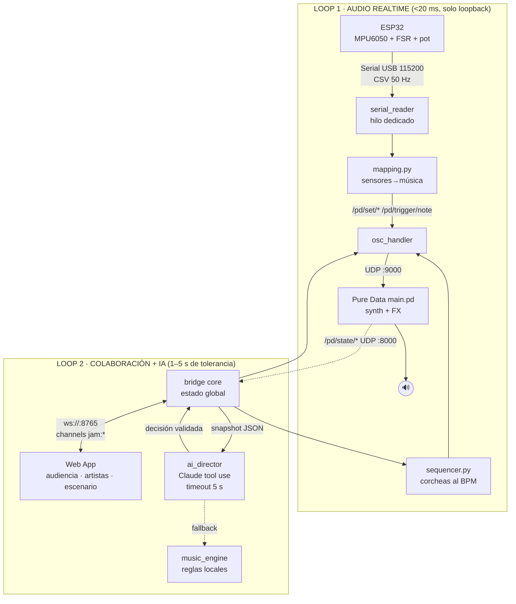

# Arquitectura — dos loops desacoplados

> Regla cardinal: **el LLM nunca está en el audio path**. Audio local <20 ms;
> colaboración e IA en un loop asíncrono tolerante a segundos.

## Presupuesto de latencia (medido/estimado)

| Tramo | Latencia | En el audio path |
|---|---|---|
| Sensor → ESP32 (ADC/I2C @ 50 Hz) | ≤ 20 ms de muestreo | sí |
| ESP32 → bridge (Serial 115200) | 1–5 ms | sí |
| mapping + OSC loopback | < 1 ms | sí |
| Pd DSP (block 64 @ 44.1 kHz) | 1.5–6 ms | sí |
| **Total gesto → sonido** | **≈ 5–15 ms** | ✅ dentro de <20 ms |
| Web ↔ bridge (WS LAN) | 5–50 ms | no (control) |
| Claude (effort low, tool forzado) | 1.5–5 s, timeout 5 s | no (asíncrono) |

## Reparto de responsabilidades

| Componente | Hace | No hace |
|---|---|---|
| **bridge/** (Python) | cerebro: estado, secuenciador, cuantización, votos, IA, presencia | audio |
| **pd-patches/main.pd** | sintetiza y reporta amplitud | lógica musical, serial, red externa |
| **web/** | UI de 3 roles + orbe | decidir nada (transporte puro) |
| **firmware/** | CSV de sensores 50 Hz | mapeo musical (vive en el bridge) |
| **Claude** | sugiere mutaciones (JSON validado) | tocar notas, generar audio |

## Cadena de fallbacks (CLAUDE.md §7)

`Claude → reglas locales` · `Portal → WS local` · `ESP32 → --mock-sensors` ·
`Pd → scripts/test-osc.py` · sin internet → todo lo anterior sigue en pie.
